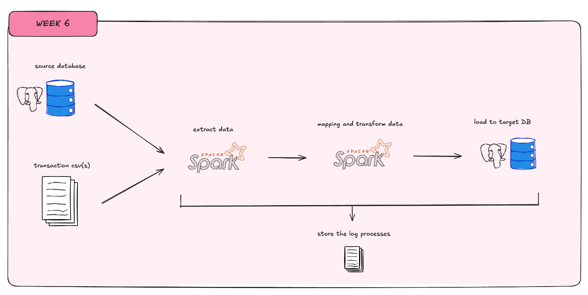
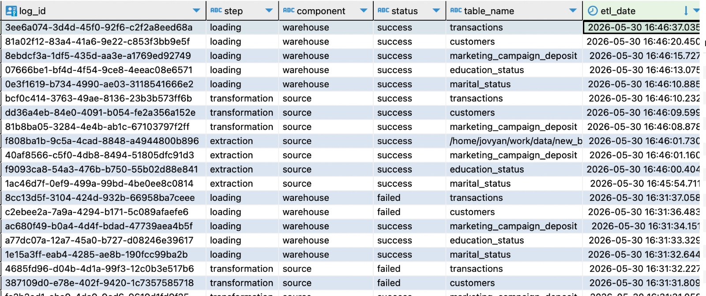

# Building Bank Marketing Campaign with PySpark

## 1. Project Description
In this project, I built an ETL data pipeline using PySpark to combine bank marketing campaign data from multiple sources into a centralized PostgreSQL data warehouse. The pipeline was designed to process a relatively large dataset of more than 800,000 records by leveraging PySpark's distributed computing capabilities.

The data comes from a bank's phone-based marketing campaigns aimed at promoting term deposit products. To support analysis, the pipeline brings together transactional and demographic data from both a relational database and a CSV file, and loads the integrated data into a data warehouse.

---

## 2. Data Sources

### PostgreSQL Database
The source database contains three tables from the bank's CRM system:

| Table | Description |
|-------|-------------|
| `education_status` | lookup table for client education levels (primary, secondary, tertiary) |
| `marital_status` | Reference/lookup table for client marital status values (single, married, divorced) |
| `marketing_campaign_deposit` | Main fact table such as client information, financial details, and campaign outcomes |

### CSV File
| File  | Description |
|------|-------------|
| `new_bank_transactions.csv` | Customer profile and transaction data including customer information, account balances, transaction amounts, transaction dates and times, and location details |

---

## 3. Project Background

### a. Data is spread across multiple sources
Campaign data is spread across three tables in a PostgreSQL database, while customer transaction data is stored separately in a large CSV file. Since the data is not available in a single location, combining and analyzing it requires additional effort. This can make reporting and analysis more time-consuming, especially when insights need to be generated across different datasets.

### b. Large files require more efficient processing
The transaction dataset contains more than 800,000 records, making it relatively large to process on a standard machine. While tools such as Pandas can work well for smaller datasets, handling data at this scale may lead to longer processing times and higher memory usage. To process the data more efficiently, a distributed computing framework such as PySpark can be used.

### c. Data is not organized for analysis
The raw data is not immediately ready for analysis and requires several cleaning and standardization steps first.

---

## 4. Solution Approach

### a. ETL Process

**Extract**
- read data from PostgreSQL source database via JDBC
- read CSV file using PySpark
- perform data profiling to understand the data structure and identify the transformations needed to meet business requirements.

**Transform**
- perform data transformations to ensure the data aligns with the defined business requirements.

**Load**
- truncate target table before loading to ensure idempotency
- append transformed data into PostgreSQL data warehouse via JDBC

---

## 5. Result

### a. log database
below is an example of a database log generated by the pipeline

### b. profiling report
the following section shows a sample of the [profiling report](script/data_profiling.json) generated by the pipeline.

### c. query sample
below is an example query used to identify the top 5 job categories with the most term deposit subscriptions.

